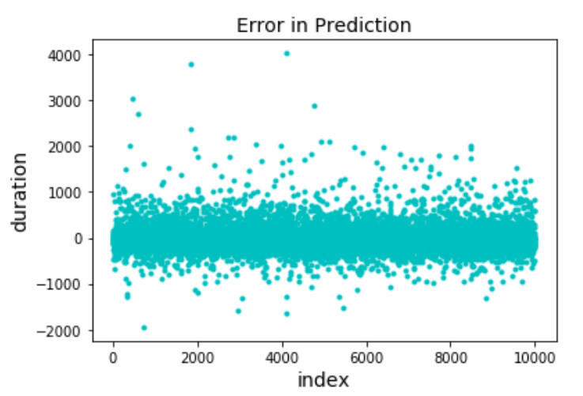

# Data Exploration, Visualization, Analysis and Predictive Modeling of NYC Yellow Taxi Trips

Authors:  **Puneet Agarwal**, **Madhubala Zambre**, **Yash Ahuja**, **Mohit Baffna**

YouTube Video:  [Link](https://youtu.be/2GRC9Qk2-xE)

---

## Introduction
### Type of data
- The dataset includes trip records from all trips completed by yellow taxis in NYC in the year 2015.
- The complete dataset has 14.6 million rows and 19 columns.
- The dataset includes information about pick-up and drop-off dates/times, pick-up and drop-off locations, trip distances, itemized fares, rate types, payment types, and driver-reported passenger counts for yellow taxi in NYC.

Table 1: Information pertaining to each column of dataset
(Source: [NYC Data Dictionary Yellow Taxi Trip Record](http://www.nyc.gov/html/tlc/downloads/pdf/data_dictionary_trip_records_yellow.pdf))


### Source of data
The data used in the dataset was collected and provided to the NYC Taxi and Limousine Commission (TLC) by technology providers authorized under the Taxicab Passenger Enhancement Program (TPEP) and is owned by [NYC opendata](https://data.cityofnewyork.us/Transportation/2015-Yellow-Taxi-Trip-Data/ba8s-jw6u).

### Data update
The dataset was created on 2nd August 2015 and was last updated on 19th December 2016.

### Motivation for selecting the present dataset
The present dataset was selected to better understand the dynamics of taxi vehicles in New York City and to address the following questions:
- Where do taxi trips occur in NYC?
- What are the predominant costs and locations of taxi trips?
- What are the important implications of the findings of predictive models and data analysis?

---
## Geo-spatial visualization of data
### Python libraries used
- *pandas* which is an open-source, easy-to-use data structures and data analysis tools for Python programming language.
- *numpy* which is the fundamental package for scientific computing with Python. It contains a powerful N-dimensional array object.
- *sodapy* which is the Python library for Socrata Open Data API.
- *matplotlib* which is Python 2D plotting library.
- *seaborn* which is a Python visualization library based on matplotlib and it provides a high-level interface for drawing attractive statistical graphics.
- *haversine* which is a Python library to calculate distance between two points on earth, located by their latitude and longitude.
- *bokeh* which is an interactive visualization library that provides versatile graphics for very large or streaming datasets.
- *datashader* which is a graphics pipeline system for creating meaningful representations of large datasets quickly and flexibly.
- *holoviews* which is an open-source Python library to make interactive plots.
### References
- Source of code for calculating haversine distance-https://pypi.org/project/haversine/
- Code for creating plots using datashader is taken from-http://datashader.org/topics/nyc_taxi.html
- Code for creating plots using holoviews is taken from-http://holoviews.org/gallery/apps/bokeh/nytaxi_hover.html
### Installation of libraries
Go to Anaconda Prompt and type the following commands:
```
pip install pandas
pip install numpy
pip install sodapy
pip install haversine
pip install seaborn
pip install bokeh
conda install -c bokeh datashader
conda install -c ioam holoviews bokeh
```

The code, `API_Project(Visualization).ipynb`, begins by importing necessary Python packages:
```
from sodapy import Socrata
import requests
from matplotlib import cm
import seaborn as sns
sns.set(style="white", palette="muted", color_codes=True)
import pandas as pd
pd.options.mode.chained_assignment = None 
import numpy as np
from haversine import haversine
from scipy.spatial.distance import euclidean , cityblock
from geopy.distance import great_circle
from math import *
from bokeh.io import output_notebook,show
from bokeh.models import HoverTool
from bokeh.plotting import figure
from bokeh.palettes import Spectral4
output_notebook()
import os.path
import datashader as ds
import datashader.transfer_functions as dtf
from datashader.colors import colormap_select as cm, inferno, viridis
from datashader.utils import lnglat_to_meters
import matplotlib as mpl
import matplotlib.pyplot as plt
from IPython.display import display, HTML
from matplotlib.colors import LinearSegmentedColormap
def bg(img): return dtf.set_background(img, "black")
mpl.rcParams['figure.dpi'] = 130
import holoviews as hv
import dask.dataframe as dd
import cartopy.crs as ccrs
from holoviews.operation.datashader import datashade
from holoviews.operation.datashader import aggregate
hv.extension('bokeh')
```
### Importing data
We import data from [NYC OpenData-2015 Yellow Taxi Trip Data](https://data.cityofnewyork.us/Transportation/2015-Yellow-Taxi-Trip-Data/ba8s-jw6u). 
Code for importing the API data for the given source is as follows:
- To get access to NYC Yellow Taxi Trip Data, we first created an account and obtained an application token.
- We used our account credentials with the following code to get access to data.
```
client = Socrata("data.cityofnewyork.us",
                  MyAppToken,
                  userame="user@example.com",
                  password="AFakePassword")
```
- We then imported the first 1 million rows of data using the following code:
```
results = client.get("2yzn-sicd",limit=1000000)
```
- We created our base dataframe 'train_data' by using data stored in 'results'.
```
train_data = pd.DataFrame.from_records(results)
```
### Data filtering for visualization
- We created a new dataframe 'data' by acquiring our columns of interest.
```
data = pd.DataFrame(train_data, columns=['pickup_datetime','dropoff_datetime','pickup_longitude','pickup_latitude','dropoff_longitude','dropoff_latitude','fare_amount','passenger_count','trip_distance'])
```
- We defined a function 'date1' to convert datetime datatype to just date.
```
import datetime
def date1(tmp):
    dt=datetime.datetime.strptime(tmp,'%Y-%m-%dT%H:%M:%S.000')
    dt.date()
    dd=dt.date()
    return (dd)
data["Pickup Date"]=data["pickup_datetime"].apply(date1)
data["Dropoff Date"]=data["dropoff_datetime"].apply(date1)
```
- We defined a function 'date2' to convert datetime datatype to just time.
```
def date2(tmp):
    dt=datetime.datetime.strptime(tmp,'%Y-%m-%dT%H:%M:%S.000')
    dt.time()
    dd=dt.time()
    return (dd)
data["Pickup time"]=data["pickup_datetime"].apply(date2)
data["Dropoff time"]=data["dropoff_datetime"].apply(date2)
```
- We converted columns with numeric values to float datatype.
```
data['pickup_latitude'] = data['pickup_latitude'].astype(float)
data['pickup_longitude'] = data['pickup_longitude'].astype(float)
data['dropoff_latitude'] = data['dropoff_latitude'].astype(float)
data['dropoff_longitude'] = data['dropoff_longitude'].astype(float)
data['fare_amount'] = data['fare_amount'].astype(float)
data['passenger_count'] = data['passenger_count'].astype(float)
data['trip_distance'] = data['trip_distance'].astype(float)
```
- We created a copy of dataframe 'data'.
```
train=data.copy()
```
- We filtered the data so as to get the desired borders of NYC and to remove unnecessary trip locations.
```
west, south, east, north = -74.03, 40.63, -73.77, 40.85

train = train[(train.pickup_latitude> south) & (train.pickup_latitude < north)]
train = train[(train.dropoff_latitude> south) & (train.dropoff_latitude < north)]
train = train[(train.pickup_longitude> west) & (train.pickup_longitude < east)]
train = train[(train.dropoff_longitude> west) & (train.dropoff_longitude < east)]
```
### Plot 1: Geo-spatial distribution of taxi pickups and dropoffs across NYC
```
f, (ax1, ax2) = plt.subplots(1, 2, sharey=True,figsize=(15,10))

train.plot(kind='scatter', x='pickup_longitude', y='pickup_latitude',
                color='orange', 
                s=.02, alpha=.6, subplots=True, ax=ax1)
ax1.set_title("Pickups")
ax1.set_facecolor('black')

train.plot(kind='scatter', x='dropoff_longitude', y='dropoff_latitude',
                color='orange', 
                s=.02, alpha=.6, subplots=True, ax=ax2)
ax2.set_title("Dropoffs")
ax2.set_facecolor('black')
```
The output from this code is shown below:

The above plot gives the geo-spatial distribution of pick-ups and drop-offs by yellow taxis across NYC in the given timeline. From this plot, it is observed that majority of the pick-up and drop-off trip locations are concentrated in Manhattan which is the business hub of NYC.

### Plot 2: Visualization of traffic trip density
- We created a copy of dataframe 'train' and generated a column of unique ids for each taxi trip using numpy.
```
df=train.copy()
df['id'] = np.random.randint(1,50000, size=len(df))
```
- We calculated the great circle distance between two points on the earth (specified in decimal degrees).
```
def haversine(lon1, lat1, lon2, lat2):
    # convert decimal degrees to radians 
    lon1, lat1, lon2, lat2 = map(np.radians, [lon1, lat1, lon2, lat2])
    # haversine formula 
    dlon = lon2 - lon1 
    dlat = lat2 - lat1
    a = np.sin(dlat/2)**2 + np.cos(lat1) * np.cos(lat2) * np.sin(dlon/2)**2
    c = 2 * np.arcsin(np.sqrt(a)) 
    meters = 1000 * 6367 * c
    return meters

df['hdist'] = haversine(df.pickup_longitude, df.pickup_latitude, df.dropoff_longitude, df.dropoff_latitude)

# Add the log haversine distance:
df['log_hdist'] = np.log(1 + df['hdist'])

# Projects longitude-latitude coordinates into Web Mercator coordinates (for visualization)
df['pickup_x'], df['pickup_y'] = lnglat_to_meters(df['pickup_longitude'], df['pickup_latitude'])
df['dropoff_x'], df['dropoff_y'] = lnglat_to_meters(df['dropoff_longitude'], df['dropoff_latitude'])
```
- We defined a function to store x and y coordinates of trip locations and to drop existing NaN values.
```
def get_lines(df):
    return pd.DataFrame({
            'x': df[['dropoff_x', 'pickup_x']].assign(dummy=np.NaN).values.flatten(),
            'y': df[['dropoff_y', 'pickup_y']].assign(dummy=np.NaN).values.flatten()})
```
- We set a condition for the haversine distances to be less than 2000 meters
```
lines = get_lines(df[lambda x: x.hdist < 2000])
```
- We created a bounding box where most of the data is:
```
nyc = {'x_range': (40.635, 40.86), 'y_range': (-74.03,-73.77)}
```
- We converted our bounding box to Web mercator coordinates
```
bottom_left = lnglat_to_meters(nyc['y_range'][0], nyc['x_range'][0])
top_right = lnglat_to_meters(nyc['y_range'][1], nyc['x_range'][1])
nyc_m = {'x_range': (bottom_left[0], top_right[0]), 'y_range': (bottom_left[1], top_right[1])}

cvs = ds.Canvas(plot_width=2000, plot_height=2000, **nyc_m)
agg = cvs.line(lines, 'x', 'y', ds.count())
bg(dtf.shade(agg, cmap=cm(inferno, 0.1), how='log'))
```
The output from this code is shown below:


Plot 2 shows the traffic trip density in NYC in the given timeline. It is observed that Manhattan has the maximum traffic density (including both taxi pick-ups and drop-offs).

### Plot 3: Interactive hover plot for visualizing traffic density at each location in NYC
- First we set plot and style options
```
hv.util.opts('Image [width=800 height=800 shared_axes=False logz=True] {+axiswise} ')
hv.util.opts("HLine VLine (color='white' line_width=1) Layout [shared_axes=False] ")
hv.util.opts("Curve [xaxis=None yaxis=None show_grid=False, show_frame=False] (color='orangered') {+framewise}")
```
- We then reproject points from Mercator to PlateCarree (latitude/longitude)
```
points = gv.Points(df, kdims=['pickup_x', 'pickup_y'], vdims=[], crs=ccrs.GOOGLE_MERCATOR)
projected = gv.operation.project_points(points, projection=ccrs.PlateCarree())
projected = projected.redim(pickup_x='lon', pickup_y='lat')
```
- We used datashader to rasterize and linked streams for interactivity
```
agg = aggregate(projected, link_inputs=True, x_sampling=0.0001, y_sampling=0.0001)
pointerx = hv.streams.PointerX(x=-74, source=projected)
pointery = hv.streams.PointerY(y=40.8,  source=projected)
vline = hv.DynamicMap(lambda x: hv.VLine(x), streams=[pointerx])
hline = hv.DynamicMap(lambda y: hv.HLine(y), streams=[pointery])
sampled = hv.util.Dynamic(agg, operation=lambda obj, x: obj.sample(lon=x), streams=[pointerx], link_inputs=False)
hvobj = ((agg * hline * vline) << sampled.opts(plot={'Curve': dict(width=100)}))
hvobj
```
The output from this code is shown below:

Region with high traffic density


Region with low traffic density


Plot with increase in zooming level


## Model for predicting taxi trip duration

### Python libraries used
- *pandas* which is an open-source, easy-to-use data structures and data analysis tools for Python programming language.
- *numpy* which is the fundamental package for scientific computing with Python. It contains a powerful N-dimensional array object.
- *sodapy* which is the Python library for Socrata Open Data API.
- *matplotlib* which is Python 2D plotting library.
- *requests* which allows you to send organic, grass-fed HTTP/1.1 requests, without the need for manual labor.
- *datetime* is a package which supplies classes for manipulating dates and times in both simple and complex ways.
- *sklearn* is a collection of Python modules relevant to machine/statistical learning and data mining.
- *scipy* is a Python-based ecosystem of open-source software for mathematics, science, and engineering.

### References
- Base code for using linear regression model came from [scikit-learn.org](http://scikit-learn.org/stable/auto_examples/linear_model/plot_ols.html#sphx-glr-auto-examples-linear-model-plot-ols-py)
- Base code for using decision tree regressor came from  [scikit-learn.org](http://scikit-learn.org/stable/auto_examples/tree/plot_tree_regression.html#sphx-glr-auto-examples-tree-plot-tree-regression-py)
- Base code for using random forest regression and prediction model came from  [scikit-learn.org](http://scikit-learn.org/stable/modules/generated/sklearn.ensemble.RandomForestRegressor.html)

### Installation of libraries
Go to Anaconda Prompt and type the following commands:
```
pip install pandas
pip install numpy
pip install sodapy
pip install requests
pip install DateTime
pip install scipy
conda install scikit-learn
```
The code, `API_Project(Model).ipynb`, begins by importing necessary Python packages:
```
import pandas as pd
from sodapy import Socrata
import numpy as np
import requests
%matplotlib inline
import matplotlib.pyplot as plt
import datetime
from sklearn.model_selection import train_test_split
from sklearn.linear_model import LinearRegression
from sklearn.tree import DecisionTreeRegressor
from sklearn.ensemble import RandomForestRegressor
from sklearn import metrics
%matplotlib inline
import scipy as sp
import matplotlib.pyplot as plt
from sklearn import linear_model
from sklearn.linear_model import LinearRegression
from sklearn.preprocessing import PolynomialFeatures
from sklearn.pipeline import Pipeline
from sklearn.cluster import KMeans
from sklearn.metrics import mean_squared_error
from geopy.geocoders import Nominatim
from scipy import cluster
from random import randint
import time
```

### Importing data
We import data from [NYC OpenData-2015 Yellow Taxi Trip Data](https://data.cityofnewyork.us/Transportation/2015-Yellow-Taxi-Trip-Data/ba8s-jw6u). 
Code for importing the API data for the given source is as follows:
- To get access to NYC Yellow Taxi Trip Data, we first created an account and obtained an application token.
- We used our account credentials with the following code to get access to data.
```
client = Socrata("data.cityofnewyork.us",
                  MyAppToken,
                  userame="user@example.com",
                  password="AFakePassword")
```
- We then imported the first 1.1 million rows of data using the following code:
```
results = client.get("2yzn-sicd",limit=1100000)
```
- We created our base dataframes 'train_data' and 'test_data' by using data stored in 'results'.
```
train_data = pd.DataFrame.from_records(results[:1000000])
test_data = pd.DataFrame.from_records(results[-100000:])
```
### Data filtering for modeling
- We defined a function 'date1' to convert datetime datatype to just date.
```
import datetime
def date1(tmp):
    dt=datetime.datetime.strptime(tmp,'%Y-%m-%dT%H:%M:%S.000')
    dt.date()
    dd=dt.date()
    return (dd)
train_data["Pickup Date"]=train_data["pickup_datetime"].apply(date1)
train_data["Dropoff Date"]=train_data["dropoff_datetime"].apply(date1)
test_data["Pickup Date"]=test_data["pickup_datetime"].apply(date1)
test_data["Dropoff Date"]=test_data["dropoff_datetime"].apply(date1)
```
- We defined a function 'date2' to convert datetime datatype to just time.
```
def date2(tmp):
    dt=datetime.datetime.strptime(tmp,'%Y-%m-%dT%H:%M:%S.000')
    dt.time()
    dd=dt.time()
    return (dd)
train_data["Pickup time"]=train_data["pickup_datetime"].apply(date2)
train_data["Dropoff time"]=train_data["dropoff_datetime"].apply(date2)
test_data["Pickup time"]=test_data["pickup_datetime"].apply(date2)
test_data["Dropoff time"]=test_data["dropoff_datetime"].apply(date2)
```
- We converted columns with numeric values to float datatype for required columns.
```
train_data['pickup_latitude'] = train_data['pickup_latitude'].astype(float)
train_data['pickup_longitude'] = train_data['pickup_longitude'].astype(float)
train_data['dropoff_latitude'] = train_data['dropoff_latitude'].astype(float)
train_data['dropoff_longitude'] = train_data['dropoff_longitude'].astype(float)
train_data['fare_amount'] = train_data['fare_amount'].astype(float)
train_data['passenger_count'] = train_data['passenger_count'].astype(float)
train_data['trip_distance'] = train_data['trip_distance'].astype(float)

test_data['pickup_latitude'] = test_data['pickup_latitude'].astype(float)
test_data['pickup_longitude'] = test_data['pickup_longitude'].astype(float)
test_data['dropoff_latitude'] = test_data['dropoff_latitude'].astype(float)
test_data['dropoff_longitude'] = test_data['dropoff_longitude'].astype(float)
test_data['fare_amount'] = test_data['fare_amount'].astype(float)
test_data['passenger_count'] = test_data['passenger_count'].astype(float)
test_data['trip_distance'] = test_data['trip_distance'].astype(float)
```
- We extracted trip duration for test and train data.
```
train_data['pickup_datetime'] = pd.to_datetime(train_data.pickup_datetime)
train_data['dropoff_datetime'] = pd.to_datetime(train_data.dropoff_datetime)
train_data['seconds']= train_data['dropoff_datetime']-train_data['pickup_datetime']
train_data['seconds'] = train_data['seconds'].dt.total_seconds()

test_data['pickup_datetime'] = pd.to_datetime(test_data.pickup_datetime)
test_data['dropoff_datetime'] = pd.to_datetime(test_data.dropoff_datetime)
test_data['seconds']= test_data['dropoff_datetime']-test_data['pickup_datetime']
test_data['seconds'] = test_data['seconds'].dt.total_seconds()
```
- We extracted month for taxi drop-offs for test and train data.
```
train_data['dropoff_datetime'] = pd.to_datetime(train_data.dropoff_datetime)
train_data['dropoff_month'] = train_data['dropoff_datetime'].dt.month

test_data['dropoff_datetime'] = pd.to_datetime(test_data.dropoff_datetime)
test_data['dropoff_month'] = test_data['dropoff_datetime'].dt.month
```
- We extracted hour, day of the week and month for test and train data.
```
train_data['pickup_month'] = train_data['pickup_datetime'].dt.month 
train_data['pickup_hour'] = train_data['pickup_datetime'].dt.hour 
train_data['pickup_weekday'] = train_data['pickup_datetime'].dt.dayofweek 

test_data['pickup_month'] = test_data['pickup_datetime'].dt.month 
test_data['pickup_hour'] = test_data['pickup_datetime'].dt.hour 
test_data['pickup_weekday'] = test_data['pickup_datetime'].dt.dayofweek 
```
- We removed outliers from the data using the following filters:
	- passenger count is 1 or more
	- coordinate outliers(location shoule be in NYC)
	- trip_duration outliers(only mean +- 2std deviation value taken)
```
train_data = train_data[train_data['passenger_count']>0]
train_data = train_data[train_data['passenger_count']<9]
train_data = train_data[train_data['pickup_longitude'] <= -73.75]
train_data = train_data[train_data['pickup_longitude'] >= -74.03]
train_data = train_data[train_data['pickup_latitude'] <= 40.85]
train_data = train_data[train_data['pickup_latitude'] >= 40.63]
train_data = train_data[train_data['dropoff_longitude'] <= -73.75]
train_data = train_data[train_data['dropoff_longitude'] >= -74.03]
train_data = train_data[train_data['dropoff_latitude'] <= 40.85]
train_data = train_data[train_data['dropoff_latitude'] >= 40.63]
trip_duration_mean = np.mean(train_data['seconds'])
trip_duration_std = np.std(train_data['seconds'])
train_data = train_data[train_data['seconds']<=trip_duration_mean + 2*trip_duration_std]
train_data = train_data[train_data['seconds']>= trip_duration_mean - 2*trip_duration_std]
test_data = test_data[test_data['passenger_count']>0]
test_data = test_data[test_data['passenger_count']<9]
test_data = test_data[test_data['pickup_longitude'] <= -73.75]
test_data = test_data[test_data['pickup_longitude'] >= -74.03]
test_data = test_data[test_data['pickup_latitude'] <= 40.85]
test_data = test_data[test_data['pickup_latitude'] >= 40.63]
test_data = test_data[test_data['dropoff_longitude'] <= -73.75]
test_data = test_data[test_data['dropoff_longitude'] >= -74.03]
test_data = test_data[test_data['dropoff_latitude'] <= 40.85]
test_data = test_data[test_data['dropoff_latitude'] >= 40.63]
trip_duration_mean = np.mean(test_data['seconds'])
trip_duration_std = np.std(test_data['seconds'])
test_data = test_data[test_data['seconds']<=trip_duration_mean + 2*trip_duration_std]
test_data = test_data[test_data['seconds']>= trip_duration_mean - 2*trip_duration_std]
```
### Regression models
- We made a matrix of features for regression ananlyis and to choose target variable.
```
X = train_data[['vendor_id','passenger_count', 'pickup_longitude',
       'pickup_latitude', 'dropoff_longitude', 'dropoff_latitude','pickup_month', 'pickup_hour',
       'pickup_weekday']]
y = train_data['seconds']
from sklearn.model_selection import train_test_split
X_train, X_test, y_train, y_test = train_test_split(X, y, test_size = 0.1, random_state = 0)
```
#### Regression model 1: Using multivariate linear regression
```
from sklearn.linear_model import LinearRegression
lreg = LinearRegression()
lreg.fit(X_train,y_train)
print(lreg)
y_pred_lreg = lreg.predict(X_test)
from sklearn import metrics
print('\nLinear Regression Performance Metrics')
print('R^2=',metrics.explained_variance_score(y_test,y_pred_lreg))
print('MAE:',metrics.mean_absolute_error(y_test,y_pred_lreg))
print('MSE:',metrics.mean_squared_error(y_test,y_pred_lreg))
print('RMSE:',np.sqrt(metrics.mean_squared_error(y_test,y_pred_lreg)))
```
#### Regression model 2: Using decision tree regressor
```
from sklearn.tree import DecisionTreeRegressor
dtree = DecisionTreeRegressor()
dtree.fit(X_train,y_train)
print(dtree)
y_pred_dtree = dtree.predict(X_test)
from sklearn import metrics
print('\nDecision Tree Regression Performance Metrics')
print('R^2=',metrics.explained_variance_score(y_test,y_pred_dtree))
print('MAE:',metrics.mean_absolute_error(y_test,y_pred_dtree))
print('MSE:',metrics.mean_squared_error(y_test,y_pred_dtree))
print('RMSE:',np.sqrt(metrics.mean_squared_error(y_test,y_pred_dtree)))
```
#### Regression model 3: Using random forest regressor
```
from sklearn.ensemble import RandomForestRegressor 
rforest = RandomForestRegressor(n_estimators = 20, n_jobs = -1)
rforest = rforest.fit(X_train,y_train)
print(rforest)
y_pred_rforest = rforest.predict(X_test)
from sklearn import metrics
print('\nRandom Forest Regression Performance Metrics')
print('R^2 =',metrics.explained_variance_score(y_test,y_pred_rforest))
print('MAE',metrics.mean_absolute_error(y_test, y_pred_rforest))
print('MSE',metrics.mean_squared_error(y_test, y_pred_rforest))
print('RMSE',np.sqrt(metrics.mean_squared_error(y_test, y_pred_rforest)))
```
Table 2: Performance metrics of regressors used

Performance metrics show that for our dataset, random forest acts as the best regressor and hence, we will be using it to predict trip durations of taxis in NYC. 

- We made a matrix of features to predict the target variable.
```
X_test= test_data[['vendor_id', 'passenger_count', 'pickup_longitude',
       'pickup_latitude', 'dropoff_longitude', 'dropoff_latitude','pickup_month', 'pickup_hour',
       'pickup_weekday']]
y_pred= rforest.predict(X_test)
```
### Plot for Importance of Features
```
plt.figure(figsize=(50,50))
pd.DataFrame({'feature': X_train.columns, \
              'importance': rforest.feature_importances_})\
              .sort_values('importance').set_index('feature')\
              .plot(kind='barh', fontsize=14)

plt.title('FEATURE IMPORTANCE',fontsize=14 )
plt.xlabel('importance',fontsize=14)
plt.ylabel('feature',fontsize=14)
plt.show()
```
The output from this code is shown below:


The above plot gives the preference values assigned to each parameter for prediction of taxi trip durations. It can be observed that pickup_longitude has the maximum weightage while the least importance is given to vendor_id.

### Graphs for comparison between predicted results and test data
```
rn = test_data.shape[0]
test_data['index']=np.arange(1,rn+1)
plt.plot(test_data['index'],test_data['seconds'],'r+',test_data['index'],y_pred,'c+')
plt.title('Prediction vs Test Data',fontsize=14 )
plt.xlabel('index',fontsize=14)
plt.ylabel('duration',fontsize=14)
plt.show()
```
The output from this code is shown below:


The above graph takes into account all the data points from test data and hence does not provide a clear analysis of results. In order to get a clear demonstration of predicted results, we plot graphs by incrementing our data points in the steps of 100, 1000, 10000 and 50000. For instance, the following graph shows the results with 10000 data points.
```
yy= y_pred[:10000]
xx= test_data['seconds'][:10000]
il = test_data['index'][:10000]
plt.plot(il,xx,'r^',ms=3)
plt.title('Test Data-10000',fontsize=14 )
plt.xlabel('index',fontsize=14)
plt.ylabel('duration',fontsize=14)
plt.show()
plt.plot(il,yy,'bx',ms=3)
plt.title('Prediction-10000 points',fontsize=14 )
plt.xlabel('index',fontsize=14)
plt.ylabel('duration',fontsize=14)
plt.show()
plt.plot(il,(xx-yy),'co',ms=3)
plt.title('Error in Prediction',fontsize=14 )
plt.xlabel('index',fontsize=14)
plt.ylabel('duration',fontsize=14)
plt.show()
```
The output from this code is shown below:




From the above graphs, it can be observed that the range of average deviation between predicted data and test data is within +/- 16.67 minutes. 

### Comparison of prediction vs test data using curve fitting 
```
plt.figure(figsize=(8,6))
z = test_data.seconds.quantile(0.99)
test_data = test_data[test_data.seconds < z]
plt.scatter(range(test_data.shape[0]), np.sort(test_data.seconds.values))
y_pred = pd.DataFrame(y_pred)
y_pred[y_pred.columns[0]]
y = y_pred.quantile(0.99)
y_pred = y_pred[y_pred< y]
y_pred
y_pred.shape[0]
np.sort(y_pred[0].values)
plt.scatter(range(y_pred.shape[0]), np.sort(y_pred[0].values))
plt.title('Curve for Duration vs index',fontsize=14 )
plt.xlabel('index', fontsize=12)
plt.ylabel('seconds', fontsize=12)
plt.show()
```
The output from this code is shown below:


From this graph, it can be observed that the prediction curve overlaps with the test data curve and hence, our prediction model provides a good estimation of trip durations which is nearly as same as the test data.

## Model for predicting the best location to pick-up customers for each day of the week of a month
### Python libraries used
- *pandas* which is an open-source, easy-to-use data structures and data analysis tools for Python programming language.
- *numpy* which is the fundamental package for scientific computing with Python. It contains a powerful N-dimensional array object.
- *matplotlib* which is Python 2D plotting library.
- *sklearn* is a collection of Python modules relevant to machine/statistical learning and data mining.
- *scipy* is a Python-based ecosystem of open-source software for mathematics, science, and engineering. 
- *geopy* is a Python library that is used to locate the coordinates of addresses, cities, countries, and landmarks across the globe using third-party geocoders and other data sources.
- *random* is a Python module that implements pseudo-random number generators for various distributions.

### References
- Syntax and code for getting address for the given x and y coordinates came from [geopy](https://geopy.readthedocs.io/en/stable/)
- Base code for using linear regression model came from [scikit-learn.org](http://scikit-learn.org/stable/modules/generated/sklearn.linear_model.LinearRegression.html)
- Base code for using K-means clustering came from [scikit-learn.org](http://scikit-learn.org/stable/auto_examples/cluster/plot_cluster_iris.html#sphx-glr-auto-examples-cluster-plot-cluster-iris-py)

### Installation of libraries
Go to Anaconda Prompt and type the following commands:
```
pip install pandas
pip install numpy
pip install scipy
conda install scikit-learn
pip install geopy
pip install random
```
The code for model 2, `API_Project(Model).ipynb`, begins by importing necessary Python packages:
```
%matplotlib inline
import numpy as np
import scipy as sp
import matplotlib.pyplot as plt
import pandas as pd
from sklearn import linear_model
from sklearn.linear_model import LinearRegression
from sklearn.preprocessing import PolynomialFeatures
from sklearn.pipeline import Pipeline
from sklearn.cluster import KMeans
from sklearn.metrics import mean_squared_error
from geopy.geocoders import Nominatim
from scipy import cluster
from random import randint
import time
```
### Data filtering
- First, We created a copy of train_data called model1 and in this copy, we created a new column call weekday.
```
model1=train_data.copy()
timestamp = pd.to_datetime(pd.Series(model1['pickup_datetime']))
model1['weekday'] = timestamp.dt.weekday_name
```
- We then select columns of interest.
```
model1 = pd.DataFrame(model1, columns=['pickup_datetime','pickup_latitude','pickup_longitude','weekday'])
```
- We then get rid off outliers in our data.
```
model1=model1[(model1['pickup_latitude'] > 40.492083) & (model1['pickup_latitude']<40.944536) & (model1['pickup_longitude']> -74.267880)& (model1['pickup_longitude']< -73.662022)]
```
### Linear regression model
- We created a regression function for calculating score.
```
def fit_model(X, y):
    model = Pipeline([('poly', PolynomialFeatures(degree=3)), ('linear', LinearRegression(fit_intercept=False))])
    model.fit(X, y)
    return model

def score_model(model, X, y, Xv, yv):
    return tuple([model.score(X, y), model.score(Xv, yv)])

def fit_model_and_score(data, response, validation, val_response):
    model = fit_model(data, response)
    return score_model(model, data, response, validation, val_response)
```
- We convert x and y coordinates to address using the following function:
```
def convert_to_address(coordinate):
    geolocator = Nominatim()
    location = geolocator.reverse(coordinate)
    return location.address
```
- We then get best location for each weekday in a month using the following function:
```
def poly_regression(my_month,my_weekday,model1):
    #get all the selected weekdays in selected month
    df_select=model1[(model1['weekday']==my_weekday) & 
                 (pd.to_datetime(model1['pickup_datetime']) < pd.datetime(2015,my_month+1,1)) &
                (pd.to_datetime(model1['pickup_datetime']) > pd.datetime(2015,my_month,1))]
    
    df_select=df_select[:70000]
 ```
 - We used Kmean to group data by longitude and latitude.
 ```
    my_cluster=100
    lon=df_select['pickup_longitude'].values
    lat=df_select['pickup_latitude'].values
    coodinate_array=np.array([[lon[i],lat[i]] for i in range(len(lon))])

    kmeans_n = KMeans(n_clusters=my_cluster,n_init=1,random_state=1000)
    kmeans_n.fit(coodinate_array)
    labels = kmeans_n.labels_
 ```
 - We then add new column call cluster.
 ```
    df_select['Cluster']=labels
 ```
- We then prepare for regression.
```
    Cluster_size=df_select.groupby('Cluster').size()
    Cluster_size=np.array([[Cluster_size[i]] for i in range(len(Cluster_size))])
    Cluster_center=kmeans_n.cluster_centers_
```
- We then get training data and testing data.
```
    train_size=int(len(Cluster_size)*0.8)
    test_size=int(len(Cluster_size)*0.2)
    train_feature=Cluster_size[:train_size]
    train_response=Cluster_center[:train_size]
    test_feature=Cluster_size[test_size:]
    test_response=Cluster_center[test_size:]
```
- We then print coefficient of determination (R^2).
```
    print ("coefficient of determination (R^2):",fit_model_and_score(train_feature, train_response,test_feature, test_response))
```
- We then used mean squared error to evaluation model.
```
    MSE_model=Pipeline([('poly', PolynomialFeatures(degree=3)),
                ('linear', LinearRegression(fit_intercept=False))])
    MSE_model.fit(train_feature, train_response)
    X_MSE=(test_feature)
    y_MSE = MSE_model.predict(X_MSE)
    print("MSE: ",mean_squared_error(test_response, y_MSE))
```
- We then predict and print best location.
```
    X=Cluster_size
    y=Cluster_center

    prediction_model=Pipeline([('poly', PolynomialFeatures(degree=3)),
                    ('linear', LinearRegression(fit_intercept=False))])
    prediction_model.fit(X, y)
    X_predict=([max(Cluster_size)])
    y_predict = prediction_model.predict(X_predict)
    print("best location for ",my_weekday, y_predict)
```
- We then prepare for visualization.
```
    for data in y_predict:
        visual_x=data[[0]]
        visual_y=data[[1]]
    
    for i in range(len(Cluster_size)):
        if (Cluster_size[i]==Cluster_size.max()):
            max_size_cluster=i
        
    actual_value=kmeans_n.cluster_centers_[max_size_cluster]
    actual_x=actual_value[0]
    actual_y=actual_value[1]
```
 - We then convert location to address.
 ```
    print("address: ",convert_to_address(str(visual_y[0])+","+str(visual_x[0])))
 ```
- We then obtain visualization for Kmean.
```
    colors = []

    for i in range(my_cluster):
        colors.append('#%06X' % randint(0, 0xFFFFFF))

    plt.figure(figsize=(18,9))
    for i in range(my_cluster):
        my_cluster_df=df_select[df_select['Cluster']==i]
        lon_x=my_cluster_df.pickup_longitude.values
        lat_y=my_cluster_df.pickup_latitude.values
        plt.scatter(lon_x,lat_y,alpha=0.2,s=100,c=colors[i])

    plt.axis([visual_x-0.1,visual_x+0.1,visual_y-0.1,visual_y+0.1])
    plt.title("visualization for kmean")
    plt.xlabel("longitude")
    plt.ylabel("latitude")
    plt.show()
```
 - We then obtain scatter plot all the data for selected weekday and prediction(best location in red).
```
    fig = plt.figure(figsize=(18,9))
    ax = fig.add_subplot(111)
    x_points=lon
    y_points=lat
    ax.scatter(lon,lat,alpha=0.2,s=100)
    ax.scatter(visual_x,visual_y ,c='r',s=100)
    ax.scatter(actual_x,actual_y ,c='y',s=100)
    ax.axis([visual_x-0.05,visual_x+0.05,visual_y-0.05,visual_y+0.05])
    ax.title.set_text("Best pick up location (red point=predicted point, yellow point=actual point)")
```
- We then define list dayweek as the days from Monday to Sunday and then find the best pickup location by using poly_regression for month 4 and day as Monday.
```
dayweek = ['Monday','Tuesday','Wednesday','Thursday','Friday','Saturday','Sunday']
poly_regression(4,dayweek[0],model1)    
```
The output from this code is shown below:


From the different combination of graphs for weekdays we observed that the pickup locations on weekdays were centered in and around Manhattan while on weekends the pickup location was around New Jersey.


    
## How to Run the Code
1. Create an account on [NYC opendata](https://data.cityofnewyork.us/login) using your credentials.


2. After you have created your account, create a new application to get access to your token.


3. Install Python packages that are required for this project. See [Installation of libraries](#installation-of-libraries) for more details.

4. Launch Jupyter Notebook using Anaconda Navigator

*NOTE: For running Jupyter Notebook, you must have an active internet connection*

5. Use the following command to extend the limit of jupyter notebook if you are importing 1 million datapoints.

`jupyter notebook --NotebookApp.iopub_data_rate_limit=100000000`

6. Go to location where `API_Project(Visualization).ipynb` (for data visualization) and `API_Project(Model).ipynb` (for prediction models) are located and open it. 

7. Use your API token alongwith account credentials to import data from [NYC OpenData-2015 Yellow Taxi Trip Data](https://data.cityofnewyork.us/Transportation/2015-Yellow-Taxi-Trip-Data/ba8s-jw6u).

8. Run each block of code by pressing key combination of Shift+Enter and wait till each block of code is processed.

---

## Summary of results
#### Data visualization
Geo-spatial distribution of pick-ups and drop-offs by yellow taxis across NYC in the given timeline shows that majority of the pick-up and drop-off trip locations are concentrated in Manhattan which is the business hub of NYC.

#### Model 1: Prediction of trip durations
On the basis of performance metrics, we chose random forest as our prediction model. While predicting, pickup_longitude was given the maximum weightage while the least importance was given to vendor_id. Through model analyis, it was observed that the range of average deviation between predicted data and test data was within +/- 16.67 minutes which validates our model accuracy. 

#### Model 2: Predicting best pickup location for taxi drivers in a given day of week
Through model analysis, we observed that the pickup locations on weekdays were centered in and around Manhattan while on weekends the pickup location was around New Jersey.

## Future scope
- For achieving greater accuracy of results, data from multiple years can be used.
- Comparative analysis can be done for green and yellow taxis and their respective efficiencies can be evaluated.
- Models for predicting tip amount for a particular tip on a given week day can be used.
- Analysis using traffic networks in NYC will help to achieve greater accuracy in prediction results.
- Weather data can also be combined with the given dataset to explore the influence of weather on traffic behavior in NYC.

