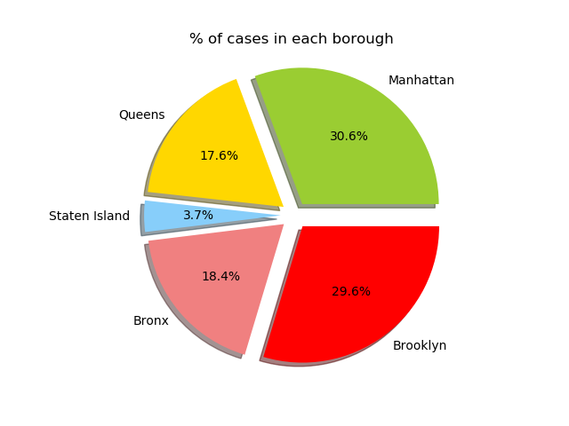
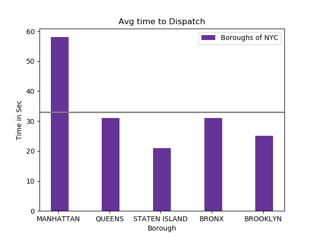

# Fire Dispatch-New York

Authors:  **Mohit Baffna** and **Yash Ahuja**

---

## Introduction
-Type of data:
The Fire Incident Dispatch Data file contains data that is generated by the Starfire Computer Aided Dispatch System. The data spans from the time the incident is created in the system to the time the incident is closed in the system. It covers information about the incident as it relates to the assignment of resources and the Fire Department’s response to the emergency. The part of data that we have used is "dispatch_response_seconds" and "alarm_box borough". The dispatch resonse seconds are the number of seconds it took for the dispatch from the Fire Department for each incident at the respective borough. The alarm box borough data was used to find out the number of incidents that took place at each borough of New York City.

-Sources of Data:
1. The data can be viewed and downloaded in the CSV or API form using the following link:
https://data.cityofnewyork.us/Public-Safety/Fire-Incident-Dispatch-Data/8m42-w767
2. The following link is where we imported the API from:
https://dev.socrata.com/foundry/data.cityofnewyork.us/mhu7-c3xb
3. The following link is where we used the syntax of pie chart.
https://matplotlib.org/1.4.1/examples/pie_and_polar_charts/pie_demo_features.html


-Frequency of updation of data
The data was last updated on October 2nd 2017 and it is updated annually.

---

## Sources

- The source code came from [https://dev.socrata.com/foundry/data.cityofnewyork.us/mhu7-c3xb](https://dev.socrata.com/foundry/data.cityofnewyork.us/mhu7-c3xb)
    -In the above link, scroll down to the bottom of the page, find the "Code Snippets" and select the second option 
     "Python Pandas" which gives the data in a Python readable format.
- The code retrieves data from [https://dev.socrata.com/](https://dev.socrata.com/)

---

## Explanation of the Code

The code, `Fire Dispatch-New York`, begins by importing necessary Python packages:
```
import matplotlib.pyplot as plt
import sodapy 
import pandas as pd
import numpy as np

```
	
-NOTE: In this code, there are packages to be installed that do not come pre-installed with Anaconda.
The packages to be installed are:
1. Pandas
2. Sodapy
To install these packages follow the following steps:

**Step 1:** Open the command window/terminal

**Step 2:** Type in *pip install pandas* to install the pandas package

**Step 3:** Type in *pip install sodapy* to install the sodapy package

We then import data from [https://data.cityofnewyork.us/resource/mhu7-c3xb].  We use Socrata(our data source) to import the API doc. Then we use pandas to convert the data into a dataframe and then we print the data to allow us to verify what we've imported:
```
client = Socrata("data.cityofnewyork.us", None)
results = client.get("mhu7-c3xb", limit=1000)
results_df = pd.DataFrame.from_records(results)
print results_df
```
NOTE:
 -In lines, "client = Socrata("data.cityofnewyork.us", None)" and "results = client.get("mhu7-c3xb", limit=1000)":
  We specify the data source and what key is used. In our case, we have got the general data set without using any key,
  because using the key is redundant. This is because we are extracting all the 1000 rows of data.
  
NOTE:  We have filtered/re-structured the raw data using the following snippet.
We have extracted the columns (alarm_box_borough, and dispatch_response_seconds_qy) using this snippet:
```
df = results_df.iloc[:,[0,9]]
mylp =  df["alarm_box_borough"].tolist()
address = [ str(x) for x in mylp ]
my_list = df["dispatch_response_seconds_qy"].tolist()
numbers = [ int(x) for x in my_list ]
```
NOTE: There is a for loop used here. This snippet of code is used to take data from the lists address[] and numbers[] we have generated and get the number of cases as well as the average time to dispatch in Manhattan. We follow the same procedure for the other four boroughs.
```
M=0
timeM= 0
for i in range (1,1000):
    if (address[i] == "MANHATTAN"):
        M = M+ 1
        float(M)
        timeM= timeM+numbers[i]
print "No of Cases in Manhattan = %f " %(M)
avgm= timeM/M
print "The average time to dispatch is = %f sec" %(avgm)
```

Finally, we visualize the data.  We save our plot as a `.png` image:
1. Pie Chart
```
labels = 'Manhattan', 'Queens', 'Staten Island', 'Bronx' ,'Brooklyn'
sizes = []
sizes.append(M)
sizes.append(Q)
sizes.append(S)
sizes.append(B)
sizes.append(BY) 
colors = ['yellowgreen', 'gold', 'lightskyblue', 'lightcoral','red']
explode = (0.1, 0.1, 0.1, 0.1, 0.1) 
plt.title('% of cases in each borough')
plt.pie(sizes, explode=explode ,labels=labels, colors=colors,
        autopct='%1.1f%%', shadow=True, startangle=0)

plt.axis('equal')
plt.savefig('Piechart.png')
plt.show()
```
2. Bar Graph
```
ind = np.arange(len(avgtime)) 
width = 0.35
fig, ax = plt.subplots()
rects1 = ax.bar(ind - width/2, avgtime, width, color='rebeccapurple', label='Boroughs of NYC')
ax.set_xlabel('Borough')
ax.set_ylabel('Time in Sec')
ax.set_title('Avg time to Dispatch')
ax.axhline(avgtimes, color='grey', linewidth=2)
ax.set_xticks(ind -0.2)
ax.set_xticklabels(('MANHATTAN', 'QUEENS', 'STATEN ISLAND', 'BRONX', 'BROOKLYN'))
ax.legend()
plt.savefig('Bargraph.png')
plt.show()
```

The output from this code is shown below:




---

## How to Run the Code
*Provide step-by-step instructions for running the code.  For example, I like to run code from the terminal:*
1. Open a terminal window/command prompt.

2. Change directories to where `Fireman_NYC.py` is saved.

3. Type the following command:
	```
	python Fireman_NYC.py
	```

Reminder: *Make sure you install pandas and sodapy packages before you run the code*

---

## Suggestions
- It is possible to plot the zipcodes on the city map of NYC which could specify the critical areas where fire is commonly
  known to break out.
- We can try to reduce the dispatch times by implementation of new fire stations. The location of these fire stations can be 
  strategically determined by the average dispatch time and the critical fire zones.
- We can use the police precinct data for fire, crime and accident cases together and device a model to forecast the 
  number of officers required to deal with the emergencies. We could also optimize this result.
